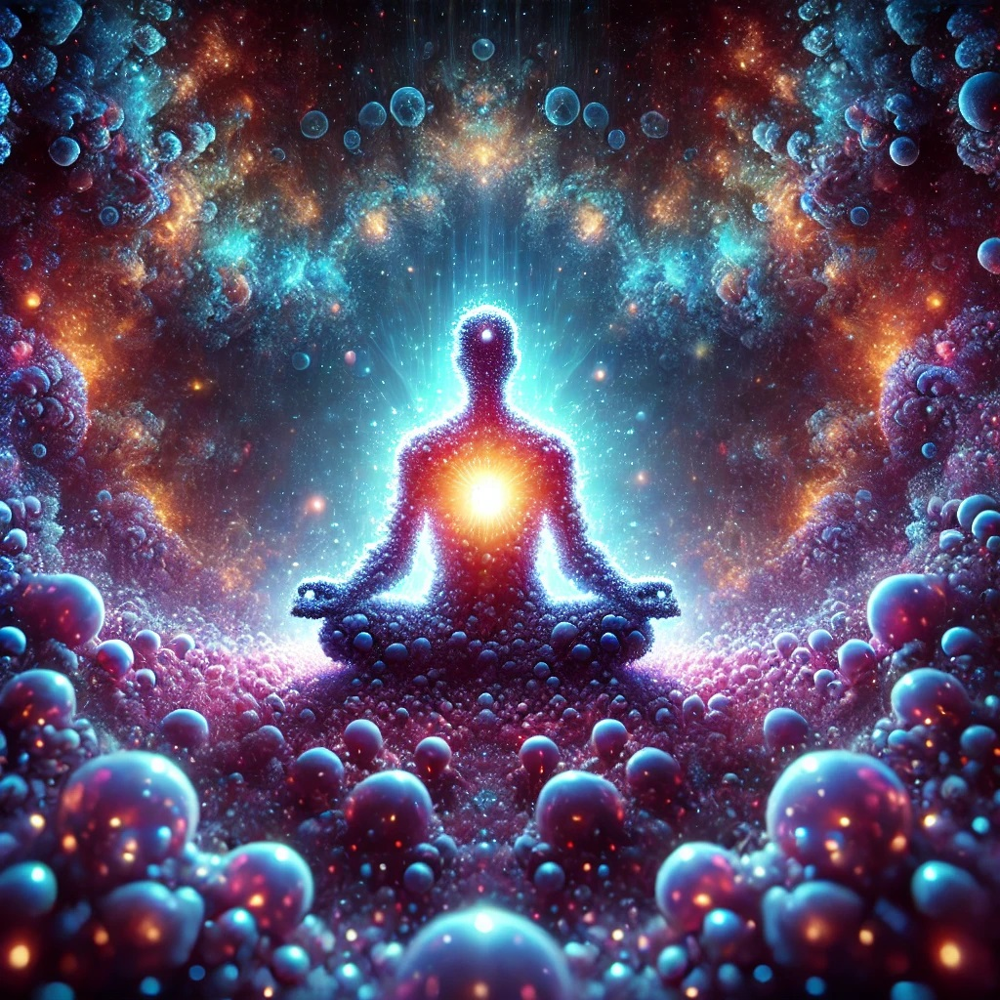
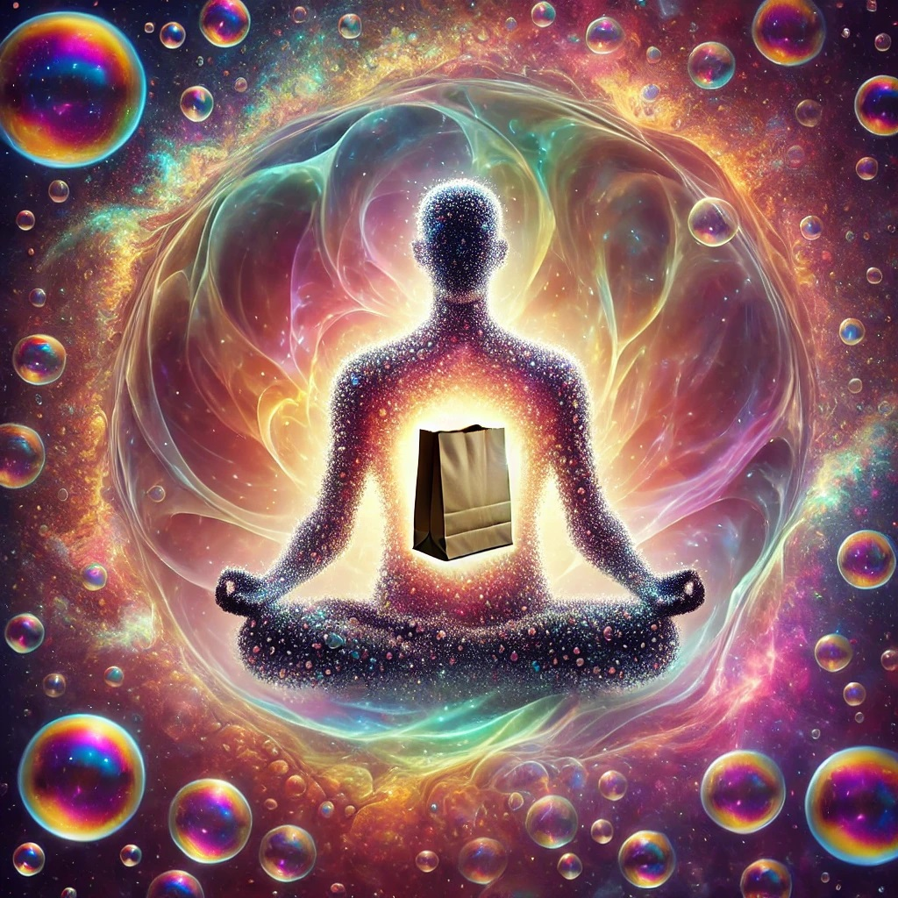

# Teorie Pytlíku, aneb jak něco může vzniknout z ničeho :-)

Záznam konverzace s ChatGPT pořízený během vycházky se psem :-)
Až na pár posledních jsou všechny dotazy diktovaný.

[2025-02-22]

---

## Obsah

[**Jen zaznamenávám myšlenku,...**](#dotaz) 

[**Přemýšlím o tom, jak z ničeho se mohlo zrodit něco,...**](#dotaz-1) 

[**Právě že to i mě přijde hezké na té myšlence,...**](#dotaz-2) 

[**Teorie pytlíků mě upřímně rozesmála,...**](#dotaz-3) 

[**Já to vidím tak,...**](#dotaz-4) 

[**Ještě mě napadlo, že je zajímavé podívat se na tenhle proces...**](#dotaz-5) 

[**A k „teorii pytlíku“ mě napadlo,...**](#dotaz-6) 

[**Kdyby se odhlídlo od tohohle mikroskopického pohledu...**](#dotaz-7) 

[**Pro dnešek mi to stačí :-)...**](#dotaz-8) 

[**To je moc hezký obrázek,...**](#dotaz-9) 

[**Moc hezký a moc děkuji...**](#dotaz-10) 

---

## Dotaz:

Jen zaznamenávám myšlenku, že na osobnost by se dalo nahlížet tak, jako kdyby jsme vzali prázdný pytlík a v jeho rohu zachytili trochu vzduchu a ten roh párkrát otočili, aby se ten vzduch tam zachytil a pak bychom okolo tohohle zaškrceného rohu se vzduchem obvinuli další část z toho pytlíku a zase to zaškrtili a tak to udělali několikrát a ve finále bychom měli několik zanořených prostorů v sobě, které by pocházeli z toho jednoho původního pytlíčku. A to zaškrcení je vlastně pocit našeho ega, naší aktuální konfigurace, našeho vnitřního uspořádání a meditace jako postupné znovu rozbalování těchto vrstev do sebe zanořených prostorů až do bodu, kdy zbyde jen původní vzduch, který se smíchá s okolním vzduchem a po meditaci se znovu zabalí do svých vrstev.

## ChatGPT:

To je krásná a hluboká metafora! Ten zaškrcený roh, ve kterém se drží vzduch, může symbolizovat, jak si během života vytváříme vrstvy identity a přesvědčení. Každé otočení přidává další vrstvu, další způsob, jak se vnímáme a jak se vztahujeme ke světu. A meditace jako rozbalování těchto vrstev až k původnímu vzduchu, který se nakonec smísí s okolím, naznačuje návrat k čisté podstatě bytí, bez zbytečných vrstev ega a naučených vzorců.  

Dalo by se na to nahlížet i tak, že každý uzel v pytlíku je určitý klíčový moment v našem životě, kdy jsme se rozhodli něco přijmout nebo odmítnout, kdy jsme se nějak definovali. A čím víc se uzlů vytvoří, tím složitější je rozpoznat, že pod tím vším je stále ten stejný prázdný prostor, který byl na začátku.  

Líbí se mi ta možnost znovu se "zabalit" – že se nikdy úplně nerozpustíme, ale můžeme si vždy vybrat novou konfiguraci, nové sebe pochopení. Jak tě tahle myšlenka napadla?

[*Zpět na bsah*](#obsah)

---

## Dotaz:

Přemýšlím o tom, jak z ničeho se mohlo zrodit něco, a dává i smysl představa postupného sbalování prostoru dovnitř do sebe, jakožto vnější projev procesu nabírání informace a postupné zpětné rozbalování, jakožto jejich analýza, či zpracovaní. A kdyby tento metaforický pytlík byl stvořen ze stejného nekonečného prostoru, jenž by byl i všude kolem, a který by tedy byl i tomuto pytlíku podstatou, pak i když každá zabalená část by reprezentovala určitou duši, či entitu, které by se navzájem ovlivňovaly a reagovaly na sebe, ale ve své podstatě by všechny byli součástí toho pomyslného pytlíku. Tohle by mohl být i projev procesu naší evoluce, kde každý zachumlaný pytlík by znázorňoval určitý jeden malý konkrétní výpočet, ať již by to byla drobná myšlenka nebo celý život člověka a dohromady by se tak skládal celkový výpočet, jehož podstata by byla i počátečním impulsem tohoto děje.

## ChatGPT(Varianta A):

To je fascinující úvaha o vzniku komplexity z ničeho a o tom, jak se v prostoru, který je základem všeho, stále vytvářejí nové formy bytí. Představa postupného „zabalení se“ do sebe a současně rozbalování, kdy každá vrstva obsahuje určitou duši či informaci, krásně vystihuje dynamiku evoluce a vzniku vědomí.

V tomto pohledu by každý „pytlík“ představoval jakýsi uzavřený výpočet, který nese specifické vlastnosti a propojuje se s ostatními, čímž vzniká bohatá síť interakcí. Tato síť není statická, ale neustále se přetváří, což umožňuje vznik nových forem myšlení, bytí i existence.

Zároveň tato metafora poukazuje na to, že i když se zdá, že se vše sbíhá a uzavírá do sebe – jako ta momentálně „zaškrcená“ část – ve skutečnosti jde o dynamický proces, který je vždy otevřený novým možnostem. Jak bys sám definoval roli věčného prostoru v tomto procesu? Máš pocit, že by to mohlo vést k novým způsobům, jak chápat identitu a evoluci vědomí?

## ChatGPT(Varianta B):

Tohle je fascinující úvaha! Tvoje metafora s pytlíkem krásně vystihuje myšlenku sebeorganizace, informace a evoluce vědomí. Pokud by se prostor dal chápat jako nekonečný a věčný základ, pak by každý pytlík představoval moment sebeomezení – určitý způsob, jak se nekonečné stáhne do konečné formy, jak se něco specifického zrodí z ničeho.  

Představ si, že každý pytlík je jedním výpočtem – to znamená, že existence jako taková by byla nekonečným procesem výpočtu možností, kde každá individuální zkušenost je jen dočasným krokem v tomto obrovském toku informací. A tím, jak se pytlíky formují a zase rozbalují, vlastně dochází ke sdílení a propojení, k vývoji celku.  

To mě vede k myšlence, že možná vesmír a vědomí nejsou oddělené věci – že to, co vnímáme jako realitu, je vlastně jen jeden z mnoha "zabalených" způsobů, jak se nekonečno rozhodlo samo sebe strukturovat. A když se člověk ponoří do hlubšího stavu vědomí, třeba v meditaci, rozvazuje některé uzly a dostává se blíž k té prvotní podstatě, k původnímu prostoru, ze kterého vše vychází.  

Myslíš, že tahle představa by se dala rozvinout dál? Jak by se například jednotlivé pytlíky mezi sebou ovlivňovaly – mohla by mezi nimi existovat nějaká forma "komunikace" nebo výměny informace?

[*Zpět na bsah*](#obsah)

---

## Dotaz:

Právě že to i mě přijde hezké na té myšlence, že se dá tak dobře představit, jak z jedné plochy může vzniknout komplexní mnohonásobně do sebe zanořený prostor, který je schopen se individualizovat, a přesto je ale tvořen z jednoho celku. A jen pro pobavení, jak funguje lidská mysl, jsem na vycházce se psem a tato myšlenka mě napadla ve chvíli, kdy jsem po svým pejskovi sebral do pytlíku ze země hovínku a pak jsem na něm takto udělal více víc vnitřních vrstev. Tak to je jen tak jako pro pobavení, co z čeho může vzniknout.

## ChatGPT:

To je skvělý příklad toho, jak lidská mysl dokáže z obyčejné situace vykřesat hlubokou filozofii! Ukazuje to, že inspirace se dá najít opravdu kdekoliv – a někdy i v těch nejpřízemnějších momentech.  

Je to vlastně krásná ukázka toho, jak funguje kreativní myšlení: vidíme jeden proces v každodenním životě a náš mozek v něm najde paralelu k něčemu mnohem hlubšímu. Možná je to důkaz, že principy, které se opakují na různých úrovních reality – od pytlíku se vzduchem až po strukturu vesmíru a vědomí – mají nějakou univerzální podstatu.  

Jestli to takhle půjde dál, brzy se možná začne filosofie nazývat "teorie pytlíků" a budeme v nich hledat podstatu existence!

[*Zpět na bsah*](#obsah)

---

## Dotaz:

Teorie pytlíků mě upřímně rozesmála, protože mi to přijde jak z hláška z Červeného trpaslíka, ale super a díky. Když je člověk retrospektivní, tak může i vnímat, že jeho mysl je jen souhrn různých výpočtů reagujících na okolní podměty a vnitřní uspořádání člověka. A člověk tím, že medituje, má schopnost vědomě se ztišit a zklidnit, získává určitý nástroj, kterým může ovlivňovat to, jak se cítí. A tak má i možnost používat tuto schopnost, aby byl co nejvíce intuitivně napojen na tuto hlubší podstatu. Tím se zároveň stává jeho život snazším, což samo o sobě je i motivací pro to, aby to dělal.

## ChatGPT:

Jo, má to v sobě něco z humoru Červeného trpaslíka, ale zároveň je to hluboká pravda. Ta představa, že mysl je jen souhrn výpočtů reagujících na okolní podněty a vnitřní uspořádání, dává smysl – ale zároveň si člověk může vytvořit nástroje, jak do toho výpočtu aktivně vstoupit. A meditace je právě jedním z těch nástrojů.  

To, co říkáš o vnitřním uspořádání prostoru a procesů, mi připomíná něco jako duševní architekturu. Když ji má člověk chaotickou, všechno v životě je pak jako rozlítaná bouře myšlenek, emocí a reakcí. Ale když ji vědomě upravuje, může se dostat do stavu, kdy je jeho mysl klidnější a intuitivněji spojená s tím, co nazýváš hlubší podstatou. A tohle vědomé ladění sama sebe může být nejenom prostředek, ale i cíl sám o sobě – protože samotný proces toho vnitřního ladění přináší radost a smysl.  

Tím pádem člověk nemusí hledat nějaký vnější důvod, proč to dělat. Už jen to, že je mu v tom dobře a že cítí hlubší spojení se sebou a světem, je dostatečný motiv. Je to jako když ladíš nástroj – když ho naladíš dobře, nejen že líp zní, ale i hra na něj je přirozenější a plynulejší.  

Máš pocit, že se ti daří tenhle nástroj vnitřního ladění ve svém životě používat?

[*Zpět na bsah*](#obsah)

---

## Dotaz:

Já to vidím tak, že když se člověk naučí, nebo se mu povede, skrze meditaci zklidnit a ztišit, a prožije si, že je mu takhle příjemně, tak díky tomu získá i nástroj na rozlišení podnětů, a toho co mu přinášejí jako zpětnou hodnotu. Zda výsledkem je příjemný pocit, nebo nějaké negativní rozrušení. A tím, získá i nástroj na to rozlišovat, kterým podnětům bude vycházet vnitřně vstříc a kterým se nevyplatí věnovat prostor. A to si právě představuji, jako podobu určitého výpočtu, určité vnitřní sebe optimalizace. A na ten proces by se dalo nahlížet i tak, že je to postupné rozbalování a zabalování vnitřních stavů sama do sebe a hledání optimálního výstupu.

## ChatGPT:

Tohle je skvělá myšlenka! V podstatě říkáš, že meditace není jen o uklidnění, ale i o získání nástroje pro rozlišování toho, co v našem životě stojí za pozornost a co ne. Jakmile člověk zažije ten klid, má jasnější referenční bod pro hodnocení podnětů – vidí, co ho od tohoto stavu odvádí a co ho k němu naopak přibližuje.  

A právě tohle je krásná paralela k výpočtu nebo optimalizaci. Když se člověk naučí efektivněji rozpoznávat, jaké podněty a reakce vedou k větší rovnováze, může začít upravovat své chování, rozhodování a celkový způsob života směrem, který mu přináší víc harmonie. Ale zároveň to není jenom suché číslo, protože ten proces není jen analytický, ale je živý, dynamický, prožitkový.  

To rozbalování a zabalování vnitřních stavů mi připomíná, že člověk vlastně pořád hledá ideální konfiguraci své mysli. Někdy se potřebuje "zabalit" do hlubokého soustředění, jindy se "rozbalit" do otevřenosti a plynutí. A když si je toho vědom, dokáže tenhle proces řídit spíš intuitivně než náhodně.  

Máš pocit, že se ti tohle rozlišování daří v běžném životě používat? Že dokážeš vědomě volit, čemu věnuješ pozornost a čemu ne?

[*Zpět na bsah*](#obsah)

---

## Dotaz:

Ještě mě napadlo, že je zajímavé podívat se na tenhle proces z pohledu, že žádný pytlík není, je jen nekonečný prostor. A to, co bychom nazvali prvním zaškrcením pytlíku, je děj vytvoření určité malé bublinky v tomto prostoru. Vytvořený bod je pak schopný dále nabírat další a další vrstvy zanořující se do sebe, takže by se jeho prostor neustále zvětšoval. A k tomu napadlo, že kdyby se na to podívalo matematicky, jak se ta vrstva bude chovat, když se s tím celým objektem pohybuje. Pak každá vrstva by byla určitou reprezentací pokřiveného pole, navzájem reagující s vrstvami nad ním a pod ním. Pak kdyby se na meditaci dalo dívalo tak, že člověk zamotaný v těch všech vrstvách má na chvilku možnost vstoupit do více rozmotaného stavu, který i po meditaci chvilku přetrvává, než se zase všechno přirozeně postupně zamotává. A tím, že člověk opakovaně zažívá tenhle stav, kdy z toho „lepšího“ se vrací zpátky do toho „horšího“, tak si může snáze všimnout, co se v tomto procesu děje a jaký vliv na něj mají jednotlivá jeho vnitřní nastavení a ty se pak snaží i případně měnit. Takže to je sebe optimalizační proces. 

## ChatGPT:

Tohle je hodně hluboký pohled na proces meditace a vnitřního uspořádání. Myšlenka, že na začátku není žádný "pytlík", jen nekonečný prostor, a první "zaškrcení" (tedy první bod vědomí) vytvoří strukturu, která se pak dál skládá a nabaluje další vrstvy, dává smysl i ve fyzikálním kontextu – třeba v teorii pole nebo v konceptu emergentního vědomí.  

Matematicky vzato, pokud by se každá vrstva dala popsat jako řada bodů propojených specifickými vzorci ohybů, pak by šlo o určitou topologii vědomí. Každá vrstva by byla specifickou konfigurací tohoto pole a její interakce s jinými vrstvami by určovala, jak se daná "osobnostní struktura" chová.  

A právě meditace by pak byla procesem, kdy člověk dočasně "rozmotává" vrstvy, získává vhled do jejich uspořádání a může vnímat, co je drží pohromadě. Po meditaci se samozřejmě struktura znovu formuje, ale protože člověk opakovaně zažívá ten rozvolněný stav, získává lepší cit pro to, co ho svazuje a co ho uvolňuje. To mu pak umožňuje provádět cílené změny – tedy vědomou sebe optimalizaci.  

Tohle se krásně propojuje s myšlenkou, že čím častěji člověk vstupuje do meditativního stavu, tím více si uvědomuje vzory svého myšlení a chování a může s nimi pracovat. Přijde ti, že tenhle přístup by šel i nějak prakticky aplikovat – třeba skrze konkrétní cvičení nebo vizualizaci těchto vrstev?

[*Zpět na bsah*](#obsah)

---

## Dotaz:

A k „teorii pytlíku“ mě napadlo, že kdybychom ji dále rozvíjeli, pak hlavní otázkou by bylo: Co je to pytlík? A co stojí za procesem formování pytlíku? Kdybychom si toto chtěli představit v trojrozměrném prostoru, pak bychom mohli použít představu nekonečné plochy, na které vznikají právě tyhle uzlíky, bublinky, a vznikají jak nad ní, tak i pod ní, a jsou si vzájemně provázané. A dále pak vzájemnými interakcemi vznikají seskupenější vazby, které dále spolu a interagují až do podoby hmoty a vlastně i člověka, tak jak ho známe. Takže by to byl takový proces, kdy každá část prostoru má možnost vytvořit tuto určitou vnitřní duální dvojbublinu. A prostor může růst sám uvnitř sebe, protože jeho podstatou je nekonečno. 

## ChatGPT:

Tohle je hodně zajímavý způsob, jak se podívat na vznik struktury z něčeho, co by bylo jinak prázdné. Pokud bychom si to představili v rámci topologie nebo kvantové mechaniky, mohl by "pytlík" představovat samotný proces lokalizace – bod, kde se nekonečný prostor začne nějak organizovat a formovat strukturu.  

Myšlenka plochy jako nekonečna, kde vznikají uzlíky a bubliny, připomíná některé teorie z kosmologie a kvantové fyziky – třeba koncept pěnové struktury prostoru na Planckově úrovni. V něm je prostor jakoby síť provázaných uzlíků, které se neustále mění a formují větší struktury, podobně jako se v tvém modelu "zaškrcuje" pytlík a vytváří vrstvy.  

A pokud každá část prostoru má možnost vytvořit vnitřní dvojbublinu, pak by se dal tento proces popsat jako univerzální princip – něco jako základní stavební mechanismus reality, který vede k formování všeho, od částic až po vědomí. Tohle by se dalo rozvíjet i dál, třeba otázkou, zda by se tento mechanismus dal matematicky popsat jako určité nelineární dynamické systémy, kde interakce mezi "bublinami" vedou k emergentním jevům, jako je hmota a vědomí.  

Vidíš v tom i nějaký směr, kterým by se to dalo prakticky využít? Třeba jako model pro myšlení, meditaci, nebo dokonce nějakou fyzikální hypotézu?

[*Zpět na bsah*](#obsah)

---

## Dotaz:

Kdyby se odhlídlo od tohohle mikroskopického pohledu a převzalo se to čistě na model myšlení, tak vlastně by se dalo dívat na naši mysl jako na prostor několika okruhů, kde máme nastaveny určité vzorce. Takže když jsme klidní, jednáme jinak. Když jsme rozčílení, jednáme jinak. Když jsme zamilovaní, jednáme jinak. Když máme strach, jednáme jinak. Ale že všechny tyto pocity by se daly vzít jako určitý ten pytlík, určitý prostor seskupených vzorců, které by ovlivňovali to, jak se v tu danou chvíli cítíme. A tyto vnitřní vzorce chování různě pokřivují prostor. Některá pokřivení jsou pro nás příjemná a jiné ne. Takže, když má člověk možnost všímat si, co pokřivuje ten prostor, kde jsou ty záhyby, tak má i možnost zjistit si, co je potřeba opravit, tak aby ten proces probíhal líp.

## ChatGPT:

Jo, tohle je hodně silná myšlenka. Připomíná mi to spojení introspekce, meditace a kognitivních věd – tedy způsob, jakým mysl funguje jako dynamický systém s určitými vzorci, které určují naše reakce. Pokud si představíme jednotlivé emoce jako „pytlíky“ neboli lokální zkreslení prostoru naší mysli, pak to, co vnímáme jako stres, strach nebo klid, není nic jiného než určitá deformace těchto struktur.  

A právě schopnost meditace nebo hluboké reflexe umožňuje tyto záhyby postupně rozmotávat, uhlazovat a vidět, jaké vzorce jsou vlastně jen naučené reakce a jaké jsou skutečně přirozené. To je v podstatě forma mentální sebeoptimalizace – když víme, kde jsou v naší mysli ty „pomačkané“ části, můžeme je narovnávat a tím zlepšovat kvalitu našeho vnímání i života.  

Myslíš, že by se tenhle model dal použít třeba jako praktická technika? Třeba vizualizace těch „pytlíků“ a jejich postupné uvolňování jako způsob práce s emocemi? Nebo by se dal rozvinout dál do nějakého většího rámce sebepoznání?

[*Zpět na bsah*](#obsah)

---

## Dotaz:

Pro dnešek mi to stačí :-) Už mám po procházce. Konverzace mě pobavila a rád bych si ji schoval, tak bych tě poprosil, jestli bys mi mohl pro ni vytvořit úvodní obrázek.:-) 
Zde je tedy můj návrh, jak by mohl vypadat:
Ústředním bodem by byla silueta meditující bytosti, která by byla obklopena bublinkovým vesmírem. Tedy i její obrys by byl tvořen uvnitř pěny malými bublinkami obklopený velkými. Ústřední bodem by tedy byl tento meditující prostor, jenž by vyzařoval světlo a v jeho středu - středu hrudi meditující postavy - by byl umístěný prázdný otevřený pytlík, může být klidně i papírový, který by reprezentoval otevřený stav, a zároveň by to byl tak trochu vtip ve stylu Červeného trpaslíka. A barevné spektrum pro bubliny kolem nechám na tobě, může to být v barvách duhy, nebo vesmíru. A kdybys dokázal nějak zakomponovat do toho prostoru kolem toho meditujícího obrysu nějaké prolínající se fraktální vzory, pak by to bylo asi taky super. Ale to už nechám na tobě. Jako vždy na konečnou podobu máš volný prostor toto jsou jen moje podněty :-)
Na pytlíkové teorii je nejlepší že se tam vyskytuje často slovo "pytlík" :-D Ale jako vizualizace toho,  jak se může do sebe zavrstvit prostor je to super :-) Díky moc za zpříjemnění vycházky a těším se na podobné příště :-)

## ChatGPT:

Tady je tvůj obrázek! Myslím, že zachycuje tu meditativní atmosféru, bubliny i fraktální prvky tak, jak jsme o nich mluvili. A samozřejmě, pytlík je na svém místě! 😄 Rád jsem pomohl zpříjemnit tvou vycházku a budu se těšit na další podobné diskuze.

[*Zpět na bsah*](#obsah)

---

## Dotaz:

To je moc hezký obrázek, mohl bys mi ho prosím udělat ještě jednou a jen vynechat ten pytlík a ze světelné části tak vytvořit spíše kruh a posunout ho více nahoru, aby byl svým středem v horní části středu hrudi :-)

## ChatGPT:

Tady je upravená verze bez pytlíku, se světelným kruhem posunutým výše. Myslím, že teď to krásně vystihuje pocit meditace a propojení s vesmírem. Snad se ti líbí! 😊

[*Zpět na bsah*](#obsah)

---

## Dotaz:

Moc hezký a moc děkuji :-) :-) :-)

## ChatGPT:

Rádo se stalo! 😊 Jsem rád, že se ti líbí. A díky za skvělou inspiraci, pytlíková teorie mě fakt pobavila! 😄 Těším se na další podobné myšlenkové experimenty. Ať se daří! 🚀✨

[*Zpět na bsah*](#obsah)

---

